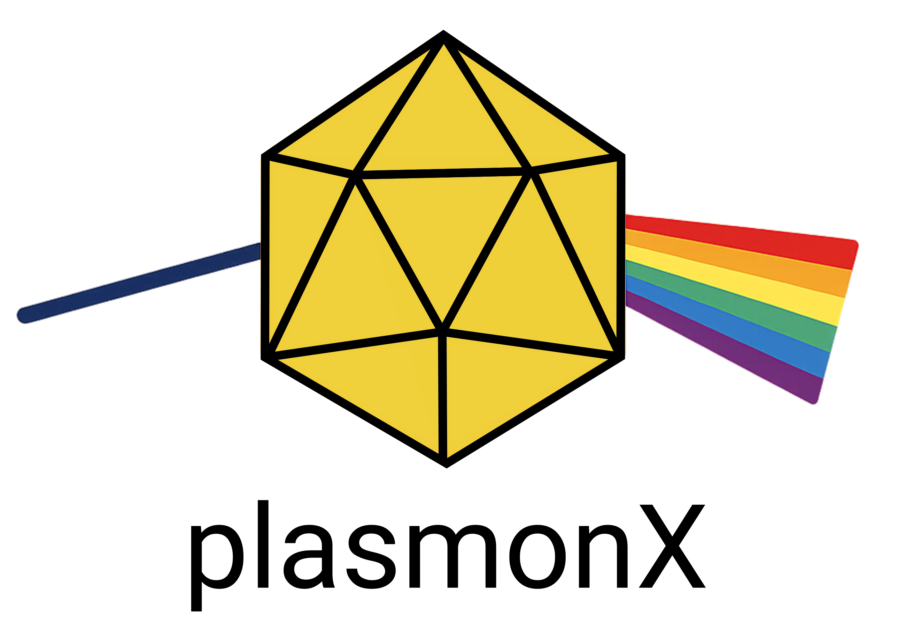

# plasmonX: an Open-Source Code for Nanoplasmonics

<p align="center">
  
</p>

**plasmonX** is a Fortran-based program implementing atomistic and implicit models for nanoplasmonics simulations in the quasi-static approximation:

- ωFQ
- ωFQFμ
- Boundary Element Methods (DPCM, IEFPCM)

---

## Documentation

plasmonX documentation (installation, input file structure, examples, etc.) is available here:
**[ReadTheDocs](https://plasmonx.readthedocs.io/)**

Alternatively, you can compile the documentation locally from the `docs` directory by running:

```bash
make latexpdf

The generated PDF version of the documentation will be available in `docs/build/latex/plasmonX_documentation.pdf`.

---

## Main References

### **ωFQ**
- T. Giovannini, M. Rosa, S. Corni, C. Cappelli.
  *Nanoscale*, **2019**, *11*, 6004–6015.
  [DOI: 10.1039/C8NR09134J](https://doi.org/10.1039/C8NR09134J)

- T. Giovannini, L. Bonatti, M. Polini, C. Cappelli.
  *J. Phys. Chem. Lett.*, **2020**, *11*, 7595–7602.
  [DOI: 10.1021/acs.jpclett.0c02051](https://doi.org/10.1021/acs.jpclett.0c02051)

### **ωFQFμ**
- T. Giovannini, L. Bonatti, P. Lafiosca, L. Nicoli, M. Castagnola, P. Grobas Illobre, S. Corni, C. Cappelli.
  *ACS Photonics*, **2022**, *9*, 3025–3034.
  [DOI: 10.1021/acsphotonics.2c00761](https://doi.org/10.1021/acsphotonics.2c00761)

- L. Nicoli, P. Lafiosca, P. Grobas Illobre, L. Bonatti, T. Giovannini, C. Cappelli.
  *Front. Photonics*, **2023**, *4*, 1199598.
  [DOI: 10.3389/fphot.2023.1199598](https://doi.org/10.3389/fphot.2023.1199598)

### **BEM**
- P. Grobas Illobre, L. Bonatti, P. Lafiosca, T. Giovannini, C. Cappelli.
  *J. Chem. Phys.*, **2025**, *162*, 044103.
  [DOI: 10.1063/5.0245629](https://doi.org/10.1063/5.0245629)

---

## Authors & Contact

- **Luca Bonatti** – Scuola Normale Superiore
- **Chiara Cappelli** – Scuola Normale Superiore
- **Stefano Corni** – University of Padova & CNR Institute of Nanoscience, Modena, Italy
- **Piero Lafiosca** – Scuola Normale Superiore
- **Tommaso Giovannini** – University of Rome Tor Vergata 
- **Pablo Grobas Illobre** – Scuola Normale Superiore
- **Luca Nicoli** – Scuola Normale Superiore

For any issue or request:
[tommaso.giovannini@uniroma2.it](mailto:tommaso.giovannini@uniroma2.it)

---

## Quick Start

To compile and run plasmonX, see the full installation instructions in the [documentation](https://plasmonx.readthedocs.io/) (under construction).

---
